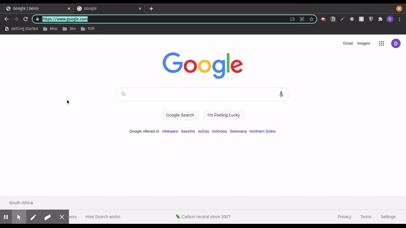
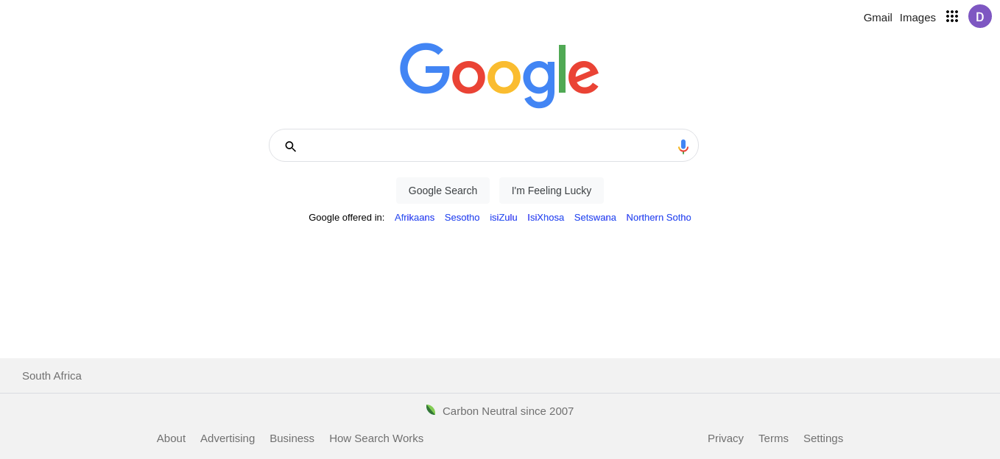

# Google Homepage
- As part of the Odin-Project, I was tasked with reproducing the google homepage - the basic version.
- Using nothing but pure CSS3 and HTML5.
- The Links, buttons and forms do not work.

## Demo
- This is GIF to contrast the [original google webpage](https://www.google.com) and the one I made.

## Product

## To-Do
- [ ] Mobile responsiveness.
- [x] Finish Styling - Any final touches.
- [x] Footer.
- [x] Buttons and Text.
- [x] Searchbar - Icon and microphone.
- [x] Find the Image - Size don't matter.
- [x] Navbar.
- [x] Layout all the HTML.

## Do-Note.
+ For now the site is not responsive per-se, majorly because of the static files.